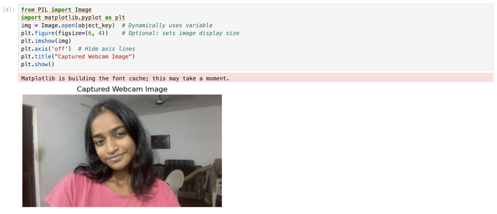
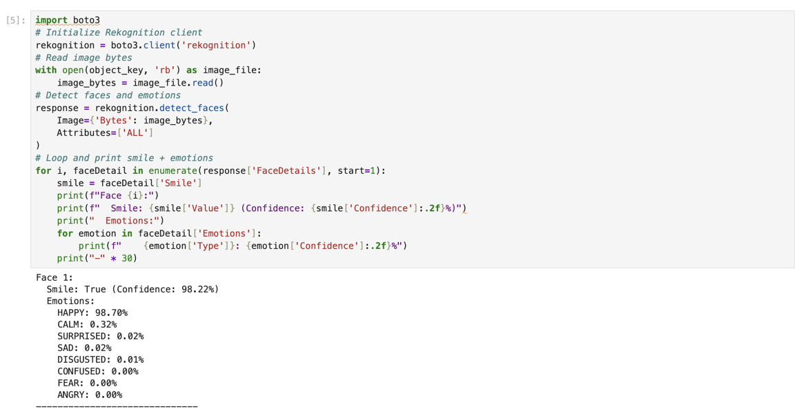
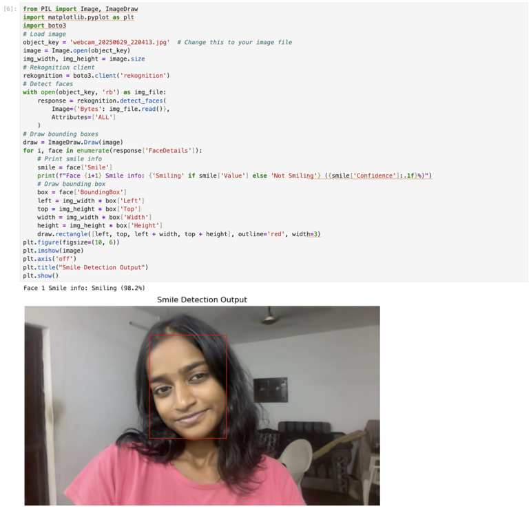

# 😊 Smile Detection Lab using Amazon Rekognition & SageMaker

This project is about building a real-time smile and emotion detection system using Python, OpenCV, Amazon S3, Amazon Rekognition, and SageMaker — where webcam images are captured, uploaded to the cloud.

---

## 🔍 What’s This All About?

This project demonstrates how to capture an image from your webcam, upload it to Amazon S3, and analyze it using Amazon Rekognition — all from a Jupyter Notebook hosted on SageMaker.

It detects whether a face in the image is smiling or not and also reveals emotional attributes like sadness, calmness, or happiness — using a single cloud-powered pipeline.

---

## 🛠️ Tools & Tech Behind the Scenes

- **Amazon S3** – Stores the captured webcam images securely.
- **Amazon Rekognition** – Detects faces, smiles, and emotions.
- **Amazon SageMaker** – Runs the analysis using Jupyter Notebooks.
- **Python & Boto3** – Scripts to automate upload and invoke Rekognition.
- **Pillow & Matplotlib** – Used to visualize and annotate image results.

---

## 🚀 How It Works

1. **Capture & Upload**
   - A Python script opens your webcam.
   - On pressing SPACE, it captures an image and uploads it to S3.

2. **Analyze with Rekognition**
   - Inside SageMaker, the uploaded image is downloaded from S3.
   - Rekognition detects faces and returns smile and emotion data.

3. **Visualize the Output**
   - Using Pillow and Matplotlib, the image is shown with bounding boxes around each face.
   - Smile status (like "Not Smiling (99.7%)") is printed in the notebook output.

---

## 📸 Output Snapshots

- **Captured Webcam Image**  
  

- **Console Output – Smile & Emotions**  
  

- **Final Image with Face Detection**  
  

---

## 🧩 Things I Learned

- Writing real-world Python scripts that use OpenCV + AWS.
- Understanding how Rekognition breaks down facial features and emotions.
- Moving beyond datasets by using **live input and real-time cloud analysis**.
- Combining multiple AWS services in a cost-effective, beginner-friendly way.

---

## ⚠️ Real-World Issues I Solved

- **Too many decimal places in confidence scores**  
  Solution: Rounded to 1 decimal using `:.1f` for cleaner display.

- **Face detection failed in low light or blurry captures**  
  Solution: Re-captured images under better lighting and framing.

- **No font visible on image output**  
  Solution: Skipped the font annotation and focused on clean bounding boxes.

- **S3 download errors**  
  Solution: Ensured correct bucket name and file key; used SageMaker terminal to list S3 files.

- **Font loading error (Arial.ttf)**  
  Solution: Used try-except block but later removed as font label wasn’t necessary.

---

## 🌟 Final Reflection

This project helped me bridge local real-time input with cloud-based AI tools.  
From capturing a photo to visualizing results — the full workflow runs smoothly on AWS, making it a great starting point for anyone exploring real-world machine learning and cloud automation.

---

## 💬 To know one thing...!

> _"There is a certain man I have to face. Until I see him, Death himself cannot touch me."_  
> — **Roronoa Zehra**
